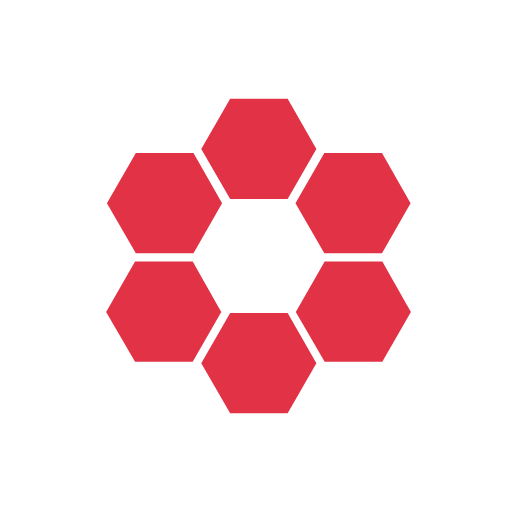

# Red

Toolchain based on Reactive Extensions for Unity Game Engine.
  
Extends the capabilities of [UniRx](https://github.com/neuecc/UniRx), allowing you to conveniently resolve dependencies and implement loose coupling between components or modules of your architecture.  

- **Containers** solve local and global dependencies and make it possible to abandon static classes, singletons.  
- **Contracts** make it easy to build MVP for UI and further interaction with business logic.  

## Introduction

First of all, you should be well versed in Rx and specifically in [UniRx](https://github.com/neuecc/UniRx).  
Learn this in detail if you still do not know it.  

## License

Red is licensed under [MIT License](Red/LICENSE.txt).